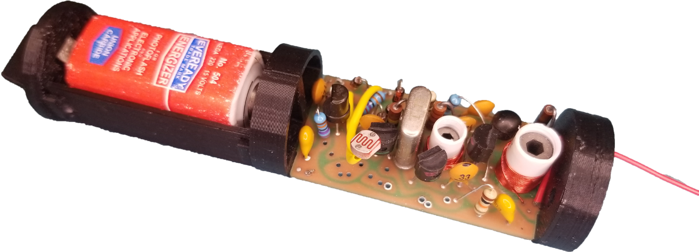

# The TRANSROC Model Rocket Transmitter

### A Recreation of the 1970s Estes Model Rocket Transmitter

The TRANSROC is a model rocket telemetry accessory designed by Estes Industries in the early 1970s.  The TRANSROC transmitted in the 27MHz Citizen Band frequency range, and could be built in several configurations, each designed to relay data from variouis types of sensors.
 

  

This project is an functional historically accurate recreation of the original transmitter, designed from photos of actual TRANSROCs, as well as from measurements and data from the original manual.

