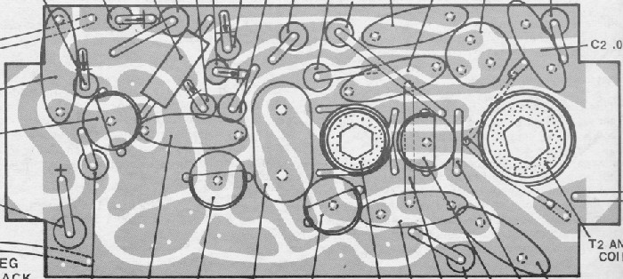
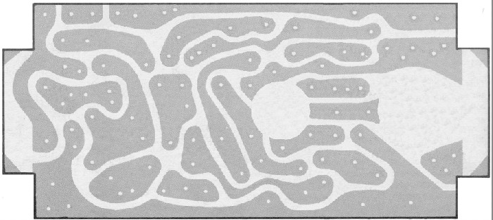
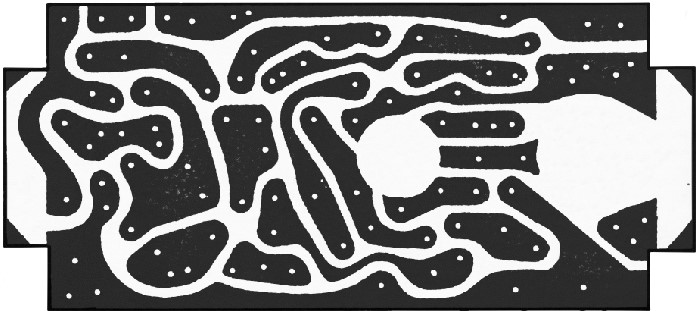
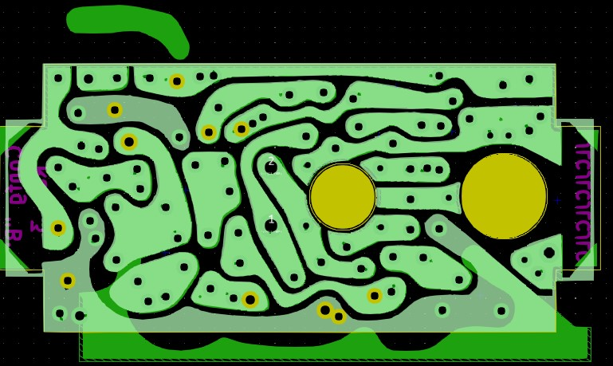
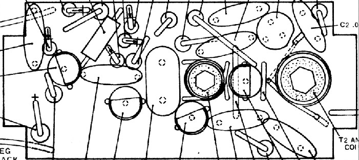
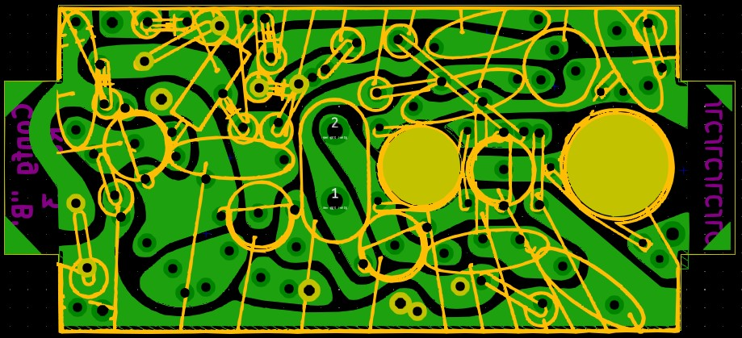

# Designed the Circuit Board

Modern PCBs typically have relatively thin traces to connect components.  "Back in the Day", wider, more rounded copper areas could be found connecting components.  The trick for the TRANSROC project was how to recreate the board in the easiest way possible.  

It was decided to take an image of the original board (a scan from the manual), and use it to trace Filled Zones within KiCad.  By naming the filled zones to match the Net names, all Design Rules passed applicable checks.  While the final board file is quite large for such a small board, the results were strikingly accurate as compared to the original board.

The basic steps were as follows:

1. A scan of the manual was made and converted to a bitmap.

  

2. PhotoShop and/or Gimp were used to remove the components:

  

3. The grey image was enhanced for more contrast:

  

4. Finally the high-contrast image was imported into KiCad with the "Bitmap to Component Converter".  The new "component" was used as model (light green) to draw filled zones matching the imported image (dark green). The new Copper component is assigned to the Eco2 layer in KiCad.

  

The above image shows two Filled Zones moved away from their proper locations to illustrate the zones vs. the new bitmap component.

&nbsp;
5. As with the Copper layer, Gimp was used to make a high-contrast image of the Silk layer from the manual:

  

6. The bitmap was again converted to a Component and imported to the Eco1 layer in KiCad.

  

